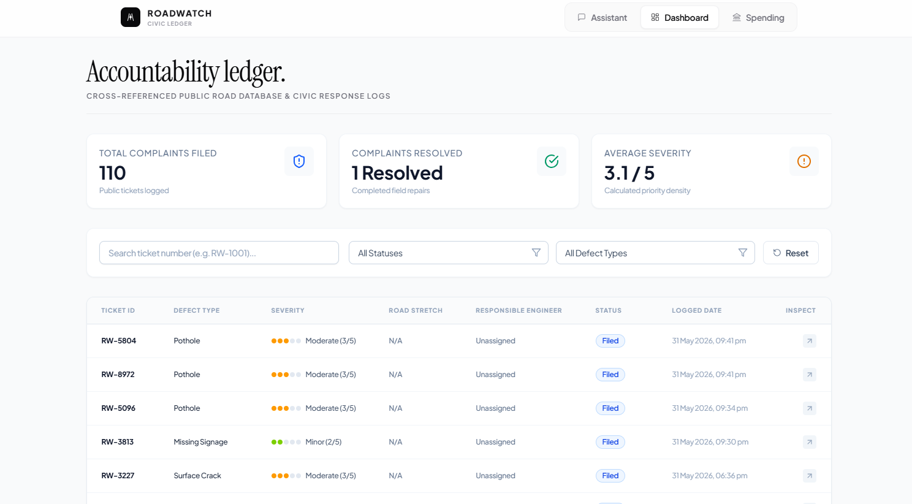

# RoadWatch

**AI-Powered Civic Accountability Platform for the BIMSTEC Region**

RoadWatch empowers everyday citizens to seamlessly report road infrastructure defects using a conversational AI interface. By simply uploading a photo and a GPS location, our pipeline automatically categorizes the issue, calculates severity using Computer Vision, maps it to the precise civic road segment, and holds the assigned engineers accountable.

<div align="center">
  
</div>

---

## Features

- **Conversational AI Agent**: Report potholes and check road quality using natural, friendly language.
- **Computer Vision (YOLOv8)**: Upload a photo of a road defect; the ML engine instantly categorizes the issue and calculates severity.
- **Spatial Routing (Uber H3)**: Instantly matches your raw GPS coordinates to specific civic road segments and automatically flags the responsible engineer.
- **Spending Dashboard**: View localized budgets, contractor histories, and civic road maintenance statuses with a single click.

## Tech Stack

- **Frontend**: React 18, Vite, TailwindCSS
- **Backend API**: FastAPI (Python 3.10+)
- **ML Engine**: Ultralytics YOLOv8 (Standalone FastAPI microservice)
- **Database**: Supabase (PostgreSQL with PostGIS)
- **AI Brain**: Groq (Llama 3.3) for intent classification
- **DevOps**: Dockerized with Docker Compose & Nginx

---

## Environment Variables

Before running the application, you must create an `apps/backend/.env` file. You can use the provided `.env.example` as a template (if available) or create it manually with the following required keys:

```ini
# Supabase Configuration
SUPABASE_URL=https://<your-project>.supabase.co
SUPABASE_KEY=<your-anon-key>
SUPABASE_SERVICE_ROLE_KEY=<your-service-role-key>

# Groq LLM Configuration
GROQ_API_KEY=<your-groq-api-key>
GROQ_MODEL=llama-3.3-70b-versatile
```
*(Note: If using Docker Compose, the `CV_SERVICE_URL` and `HOST` variables are injected automatically.)*

---

## Quick Start (Docker)

The easiest way to run the entire RoadWatch stack (Frontend, Backend, and ML Microservice) is using Docker Compose.

**1. Clone the repository:**
```bash
git clone https://github.com/krishnagoyal099/Roadwatch.git
cd Roadwatch
```

**2. Launch the entire civic platform:**
Make sure you have Docker installed, then run:
```bash
docker-compose up --build
```

The services will spin up and bind to these ports:
- **Frontend Web App:** http://localhost:5173
- **Backend API:** http://localhost:8000
- **ML Service:** http://localhost:8001

---

## Manual Setup (For Development)

If you prefer to run the services individually for active development:

**1. Start the ML Service**:
```bash
cd apps/ml
pip install -r requirements.txt
uvicorn api.analyse_image:app --port 8001
```

**2. Start the Backend API**:
```bash
cd apps/backend
pip install -r requirements.txt
uvicorn app.main:app --port 8000
```

**3. Start the Frontend**:
```bash
cd apps/frontend
npm install
npm run dev
```

---

## Documentation

Dive deeper into the architecture and system design:
- [System Architecture](docs/architecture/system-design.md) - Learn how the microservices communicate.
- [API Flow](docs/architecture/api-flow.md) - Sequence diagrams for the Chatbot and CV engine.
- [H3 Spatial Routing](docs/architecture/h3-routing.md) - How we match coordinates to road segments.
- [Supabase Setup](docs/deployment/supabase.md) - Database schema and row-level security.
